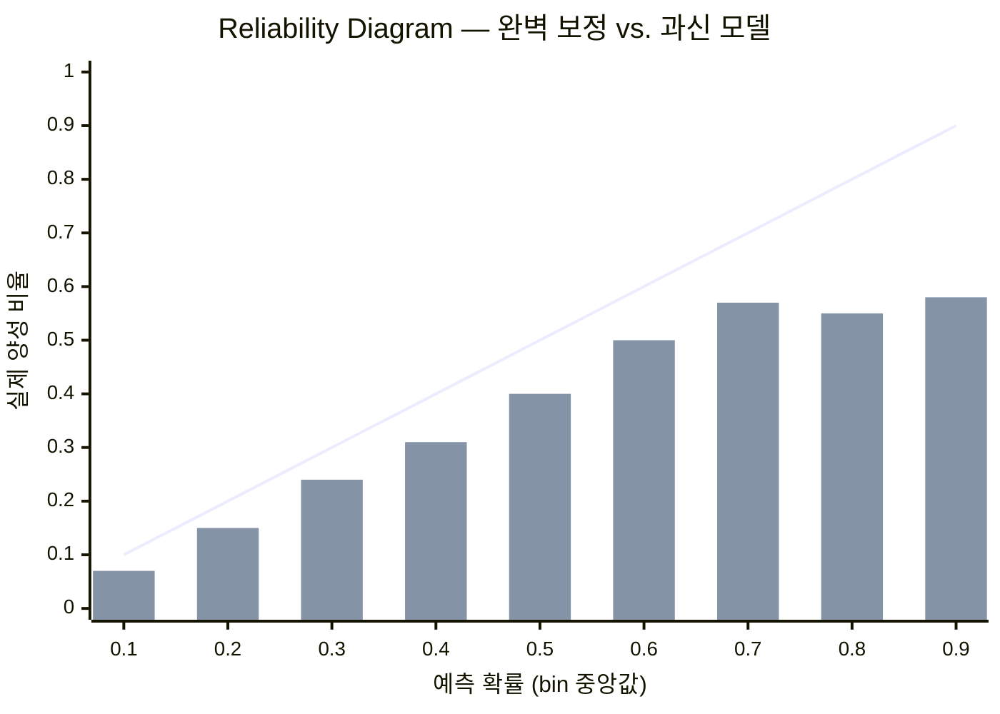
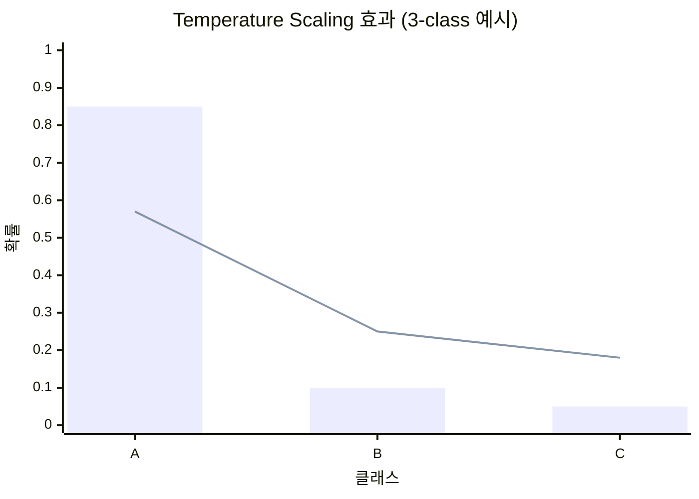
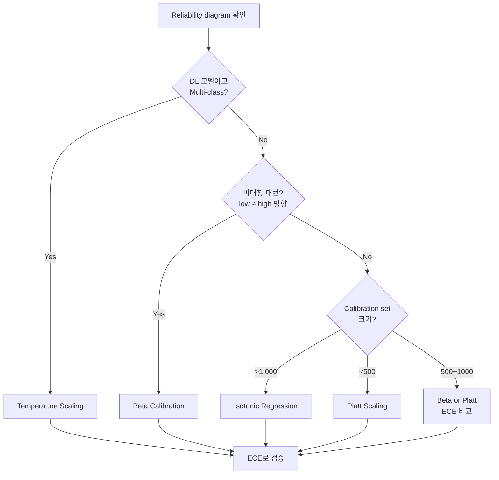

## 문제

분류 모델이 "이 환자의 불량 예후 확률은 70%"라고 출력했다. 의사가 이걸 보고 치료 방침을 결정한다. 그런데 이 70%가 *실제로* 70%인지는 별개의 문제다.

AUC 0.88이면 좋은 모델이라고 생각하기 쉽다. 맞는 말이지만, AUC는 **순위**만 평가한다. "A 환자가 B 환자보다 위험하다"는 맞추지만, "A 환자의 위험도가 정확히 70%다"는 보장하지 않는다. 실제로는 45%일 수도, 92%일 수도 있다.

Reliability diagram을 처음 그려봤을 때 이게 얼마나 심한지 알았다. 예측 확률 0.8~0.9 구간의 실제 발생률이 0.55 정도였다. AUC는 멀쩡한데 확률 값 자체는 완전히 틀린 모델이었다.

## Calibration이란

정의는 단순하다. "예측 확률 $p$인 샘플들 중 실제 양성 비율이 $p$"이면 <strong>완벽히 보정됨(perfectly calibrated)</strong>이다.

$$P(Y=1 \mid \hat{p}(X) = p) = p, \quad \forall p \in [0, 1]$$

이걸 측정하는 표준 지표가 <strong>ECE(Expected Calibration Error)</strong>다. 예측 확률을 $B$개 구간(bin)으로 나누고, 각 구간에서 예측 평균과 실제 빈도의 차이를 가중 평균한다.

$$ECE = \sum_{b=1}^{B} \frac{|B_b|}{n} \left| \text{acc}(B_b) - \text{conf}(B_b) \right|$$

$\text{acc}(B_b)$는 구간 $b$의 실제 양성 비율, $\text{conf}(B_b)$는 예측 확률 평균이다. ECE가 0이면 완벽, 낮을수록 좋다. **Reliability diagram**은 이걸 시각화한 것으로, 대각선에 가까울수록 잘 보정된 모델이다.

ECE 자체가 bin 수에 꽤 민감하다는 점은 알아둘 필요가 있다. bin=10이냐 15냐에 따라 "잘 보정됨"과 "개선 필요" 사이를 오가는 경우가 있었다. 대안으로 등빈도 bin을 쓰는 ACE나, worst-case bin만 보는 MCE가 있다.



막대가 대각선(line) 아래에 있을수록 과신(overconfident) — 예측은 높은데 실제는 낮다. 막대가 위에 있으면 과소예측(underconfident).

## 왜 DL 모델은 overconfident한가

Guo et al. (2017)이 체계적으로 보여준 현상이다. 현대 딥러닝 모델은 거의 예외 없이 **과신(overconfident)** 한다 — 예측 확률이 실제보다 극단적으로 나온다.

```
잘 보정됨:       예측 70% → 실제 70%
과신(실제 DL):   예측 90% → 실제 60%
```

원인은 여러 가지인데, 모델 capacity 증가, NLL 과최적화, batch normalization 등이 복합적으로 작용한다. 결론은 하나다: **DL 모델의 softmax 출력을 그대로 확률로 믿으면 안 된다.**

학습 단계에서 이걸 완화하는 방법도 있다. **Label smoothing** (hard label 0/1 대신 0.1/0.9로 학습)이나 **focal loss** (어려운 샘플에 집중)가 대표적이다. 하지만 이들은 학습 자체를 바꿔야 해서, 이미 학습이 끝난 모델에는 적용할 수 없다.

그래서 **post-hoc calibration** — 학습 완료 후 확률만 보정하는 방법이 필요하다.

## 방법 1: Platt Scaling

가장 오래되고 단순한 방법이다. Platt (1999)가 SVM의 decision value를 확률로 바꾸기 위해 제안했다.

모델 출력 $f(x)$를 sigmoid에 통과시킨다:

$$P(y=1 \mid f(x)) = \frac{1}{1 + \exp(A \cdot f(x) + B)}$$

$A$, $B$ 두 개의 파라미터를 hold-out validation set에서 NLL 최소화로 학습한다. 이게 전부다.

파라미터가 2개뿐이라 overfitting 위험이 거의 없고, 단조 변환이므로 **AUC가 보존**된다. 500개 미만의 calibration set에서도 안정적으로 동작한다.

```python
from sklearn.calibration import CalibratedClassifierCV

calibrated = CalibratedClassifierCV(model, method='sigmoid', cv=5)
calibrated.fit(X_val, y_val)
prob = calibrated.predict_proba(X_test)
```

한계는 명확하다. 보정 함수가 **sigmoid 하나**로 고정된다. 실제 보정 곡선이 비대칭이거나 S자가 아니면 잘 안 맞는다.

## 방법 2: Temperature Scaling

Platt scaling의 DL 특화 단순화 버전이다. Softmax 출력의 logit $z_k$를 단일 스칼라 $T$로 나눈다:

$$P(y=k) = \frac{\exp(z_k / T)}{\sum_j \exp(z_j / T)}$$

- $T > 1$: softmax를 부드럽게 → overconfidence 완화
- $T < 1$: 날카롭게 → underconfidence 완화
- $T = 1$: 원래 모델



막대(T=1, 원래 모델): class A에 0.85가 몰린 과신 상태. 선(T=2 적용 후): 분포가 완만해져 더 현실적인 불확실성 표현.

**파라미터가 딱 1개**이므로 overfitting이 사실상 불가능하다. Multi-class에서도 자연스럽게 동작한다는 것이 Platt 대비 큰 장점이다. Guo et al. (2017)이 DL 모델에 가장 효과적인 post-hoc 방법으로 실증했다.

다만 모든 class에 **동일한 T**를 적용하므로, class별로 miscalibration 방향이 다르면 한계가 있다. 이걸 확장한 것이 vector scaling ($K$개 파라미터)과 matrix scaling ($K^2 + K$개 파라미터)이다.

## 방법 3: Beta Calibration

Platt scaling의 sigmoid 가정이 깨지는 경우를 위해 Kull et al. (2017)이 제안했다.

모델 출력 $s \in (0, 1)$에 대해:

$$\text{logit}(P) = c + a \cdot \ln(s) - b \cdot \ln(1 - s)$$

Platt이 $\text{logit}(P) = A \cdot f(x) + B$로 raw output에 linear 변환을 거는 반면, beta는 $\ln(s)$와 $\ln(1-s)$라는 **두 개의 log 변환에 독립적인 계수**를 사용한다.

핵심은 $a \neq b$일 때 드러난다. 0 근처와 1 근처에서 **서로 다른 보정 강도**를 적용할 수 있다.

```
예측 0.1~0.3 구간: 과소예측 (실제가 더 높음)
예측 0.7~0.9 구간: 과대예측 (실제가 더 낮음)
→ Platt의 sigmoid 하나로는 이 비대칭을 못 잡음
→ Beta의 a ≠ b가 자연스럽게 처리
```

실무에서 이 비대칭 패턴이 생각보다 자주 나온다. Random forest나 naive Bayes처럼 예측 분포가 양극단에 몰리는 모델에서 특히 그렇다.

파라미터가 3개(Platt보다 1개 많음)인데, parametric이라 isotonic보다 안정적이고 연속 함수라 불연속 문제도 없다. 다만 scikit-learn에 내장되어 있지 않아서 `betacal` 패키지를 쓰거나 직접 구현해야 한다.

```python
from betacal import BetaCalibration

bc = BetaCalibration(parameters="abm")
bc.fit(predicted_probs, true_labels)
calibrated = bc.predict(test_probs)
```

## 방법 4: Isotonic Regression

비모수적 접근이다. 보정 함수의 형태에 **아무 가정을 하지 않는다.** 모델 출력 $f(x)$와 실제 라벨 사이의 관계를 단조증가(isotonic) 제약 하에 자유롭게 학습한다.

$$\hat{y} = m(f(x)), \quad m \text{은 단조증가}$$

Pool Adjacent Violators (PAV) 알고리즘으로 풀며, 결과는 step function이 된다.

유연성은 최고다. Sigmoid도 아니고 S자도 아닌 기묘한 보정 곡선도 포착할 수 있다. 구간별로 보정 방향이 다른 경우 — low-risk에서는 과소, mid-risk에서는 과대, high-risk에서는 다시 과소 — 이런 패턴도 잡는다.

대가는 **데이터**다. 비모수적이므로 calibration set이 작으면 overfitting한다. 최소 1,000개는 있어야 안정적이다. 그리고 step function이라 유사한 예측값에 다른 보정 확률이 할당될 수 있다.

```python
calibrated = CalibratedClassifierCV(model, method='isotonic', cv=5)
calibrated.fit(X_val, y_val)
prob = calibrated.predict_proba(X_test)
```

## 언제 무엇을 쓸 것인가

| 기준 | Platt | Temperature | Beta | Isotonic |
|------|-------|-------------|------|----------|
| 파라미터 | 2 | 1 | 3 | non-param |
| 최소 데이터 | ~200 | ~200 | ~500 | ~1,000 |
| 비대칭 보정 | ❌ | ❌ | ✅ | ✅ |
| 연속성 | smooth | smooth | smooth | step |
| Multi-class | 확장 필요 | 자연 지원 | 확장 필요 | 확장 필요 |
| 추천 상황 | 소규모, SVM/GBM | DL softmax | RF, 비대칭 패턴 | 대규모, 복잡 패턴 |

실무에서의 의사결정 흐름은 이렇다:



어떤 방법을 쓰든 **반드시 hold-out set으로 보정**해야 한다. Train set으로 보정하면 data leakage다.

## 정리

- AUC가 높아도 확률이 틀릴 수 있다. Reliability diagram으로 확인하는 것이 첫 번째다.
- 네 가지 방법은 유연성-안정성 스펙트럼 위에 있다: Platt(가장 안정) → Temperature → Beta → Isotonic(가장 유연).
- 대부분의 실무 상황에서는 temperature scaling(DL)이나 beta calibration(비대칭 패턴)이면 충분하다.
