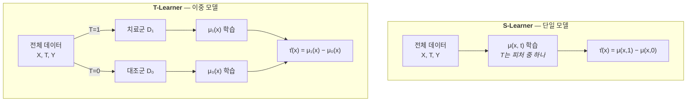
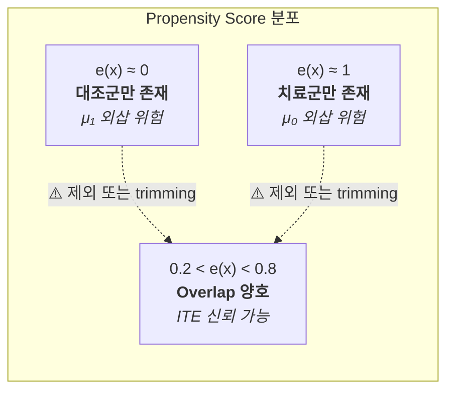
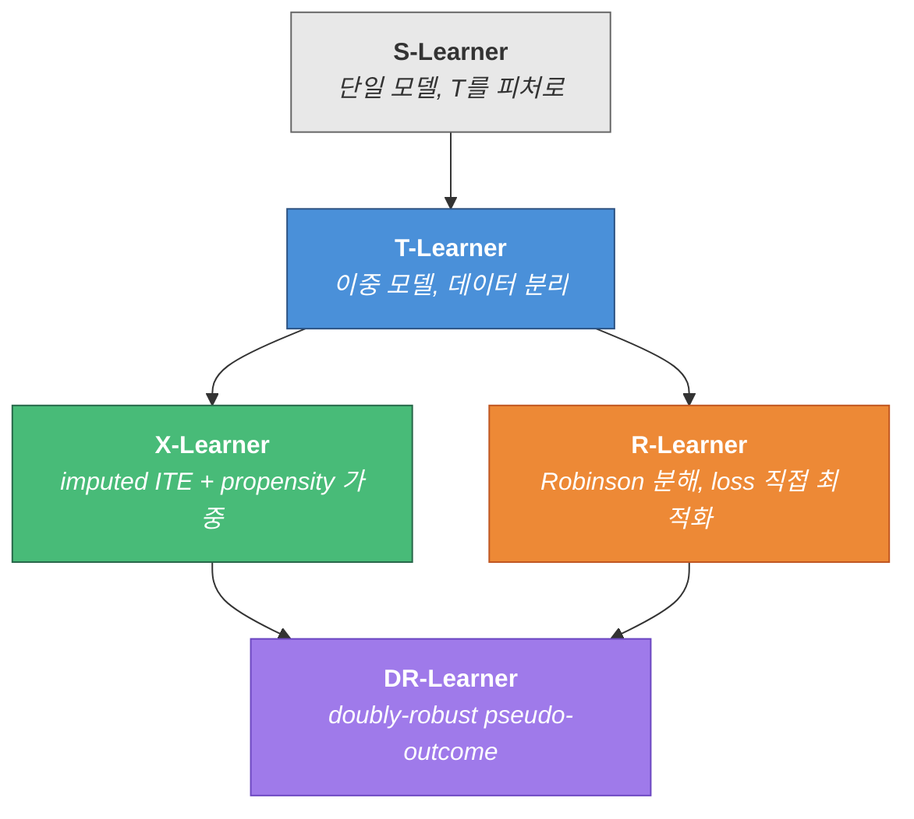

## 문제

환자 한 명이 응급실에 왔다. 약을 줄 것인가, 말 것인가.

RCT에서 나온 **ATE**(Average Treatment Effect)는 "이 약은 *평균적으로* 효과가 있다"고 말해준다. 하지만 **이 환자에게** 얼마나 효과가 있을지는 알려주지 않는다. NIHSS 25점짜리 중증 환자와 3점짜리 경증 환자가 같은 약에서 같은 이득을 볼 리가 없다.

이 환자 수준의 효과 차이를 **이질적 치료 효과(HTE, Heterogeneous Treatment Effect)**라 부르고, 개인 수준으로 내리면 **ITE(Individual Treatment Effect)**가 된다. 조건부 평균으로 집계하면 **CATE(Conditional Average Treatment Effect)** — 실무에서 추정의 타겟이 되는 양이다.

문제는 근본적이다. 한 환자에게 약을 주면서 동시에 안 줄 수 없다. **관찰되지 않는 반사실(counterfactual)의 벽.** 우리는 항상 potential outcome 중 하나만 관찰한다.

T-Learner는 이 벽을 우회하는 *가장 직관적인* 방법이다.

## 수학적 정의

**Potential outcomes framework**(Rubin, 1974)에서 시작한다. 환자 $i$에 대해:

$$Y_i(1) = \text{치료 시 결과}, \quad Y_i(0) = \text{비치료 시 결과}$$

$$\tau(x) = \mathbb{E}[Y(1) - Y(0) \mid X = x]$$

이것이 **CATE**다. $\tau(x)$를 추정하려면 두 conditional expectation이 필요하다:

$$\mu_1(x) = \mathbb{E}[Y \mid X=x, T=1], \quad \mu_0(x) = \mathbb{E}[Y \mid X=x, T=0]$$

**Identification assumption** 하에서:

$$\tau(x) = \mu_1(x) - \mu_0(x)$$

"T"는 **Two** — 두 개의 독립 모델이라는 뜻이다. 치료군 데이터 $\mathcal{D}_1 = \{(X_i, Y_i) : T_i = 1\}$로 $\hat{\mu}_1$을, 대조군 데이터 $\mathcal{D}_0 = \{(X_i, Y_i) : T_i = 0\}$로 $\hat{\mu}_0$를 학습한다.

$$\hat{\tau}(x) = \hat{\mu}_1(x) - \hat{\mu}_0(x)$$

이게 전부다. 놀라울 정도로 단순하다.

하지만 이 단순함에는 대가가 있다. 뒤에서 MSE를 분해하면 왜 그런지 보인다.

## S-Learner와의 비교



**S-Learner** — 치료 변수 $T$를 피처 중 하나로 넣고 단일 모델을 학습한다.

$$\hat{\tau}(x) = \hat{\mu}(x, 1) - \hat{\mu}(x, 0)$$

모든 데이터를 쓰니 *통계적 파워는 높다.* 하지만 $T$가 수십 개 피처 중 하나일 뿐이라 **정규화 과정에서 치료 효과 신호가 희석**될 수 있다. Tree 기반 모델에서 $T$가 split에 한 번도 안 잡히면 $\hat{\tau}(x) \equiv 0$이 된다 — 치료 효과가 분명히 존재하는데도.

**T-Learner** — 데이터를 치료군/대조군으로 나눠서 *아예 별도 모델*을 학습한다. 치료 효과를 놓칠 일은 없다. 두 모델이 완전히 다른 함수를 학습할 수 있으니까.

대신 각 모델에 들어가는 데이터가 줄어든다. 치료군이 전체의 10%인 관찰 데이터라면 $\hat{\mu}_1$은 고작 *10% 데이터로 학습*해야 한다.

처음에는 이 트레이드오프가 별것 아닌 것 같았다. 실무에서 겪어보니 생각보다 판단을 많이 흔든다.

## 오차의 구조: MSE 분해

T-Learner의 추정 오차를 분해하면 그 구조적 한계가 명확해진다.

$$\text{MSE}[\hat{\tau}(x)] = \text{MSE}[\hat{\mu}_1(x)] + \text{MSE}[\hat{\mu}_0(x)] - 2 \cdot \text{Cov}[\hat{\mu}_1(x), \hat{\mu}_0(x)]$$

$\hat{\mu}_1$과 $\hat{\mu}_0$는 **독립적인 데이터셋**으로 학습되므로 공분산 항은 0에 가깝다. 결과적으로:

$$\text{MSE}[\hat{\tau}(x)] \approx \text{MSE}[\hat{\mu}_1(x)] + \text{MSE}[\hat{\mu}_0(x)]$$

오차가 *합산*된다. 각 모델이 아무리 잘 맞춰도, CATE 추정의 오차는 두 모델 오차의 합이다. 특히 $n_1 \ll n_0$이면 $\hat{\mu}_1$의 분산이 지배적이 되어 전체 추정이 불안정해진다.

이걸 처음 유도했을 때 좀 놀랐다. *두 모델 모두 MSE가 0.01이어도 CATE의 MSE는 0.02*라는 건, 의외로 큰 수치다.

반면 S-Learner는 단일 모델의 MSE만 관여하지만, 정규화 편향이 $\hat{\tau}$를 0 쪽으로 끌어당긴다. 이건 bias-variance의 전형적인 트레이드오프다.

### 수렴률

Nonparametric regression에서 $d$차원 피처 공간의 minimax 수렴률은:

$$\text{MSE} = O(n^{-2s/(2s+d)})$$

($s$는 smoothness). T-Learner에서 $\hat{\mu}_1$의 수렴률은 $O(n_1^{-2s/(2s+d)})$이다.

치료 비율이 $\pi$이면 $n_1 = n\pi$이므로:

$$\text{MSE}[\hat{\tau}] = O\left((n\pi)^{-\frac{2s}{2s+d}} + (n(1-\pi))^{-\frac{2s}{2s+d}}\right)$$

$\pi = 0.5$(균형)이면 두 항이 같아서 최적이지만, **$\pi \to 0$이면 첫째 항이 발산한다.** 관찰 데이터에서 치료 비율이 낮은 건 흔한 일이라, 이건 이론적 경고 이상의 실질적 문제다.

## 구현

Python으로 시뮬레이션 데이터에 적용한다. 치료 효과가 $X_1$(중증도)에 *비례*하는 상황을 만들었다.

```python
import numpy as np
from sklearn.ensemble import GradientBoostingRegressor

np.random.seed(42)
n = 5000

# 시뮬레이션: X1이 높을수록 치료 효과가 큼
X = np.random.randn(n, 5)
propensity = 1 / (1 + np.exp(-X[:, 0]))
T = np.random.binomial(1, propensity)

# True CATE = 0.5 * X1
tau_true = 0.5 * X[:, 0]
Y = X[:, 0] + X[:, 1] + tau_true * T + np.random.randn(n) * 0.5

# T-Learner
mask1, mask0 = T == 1, T == 0
mu1 = GradientBoostingRegressor(n_estimators=200).fit(X[mask1], Y[mask1])
mu0 = GradientBoostingRegressor(n_estimators=200).fit(X[mask0], Y[mask0])

tau_hat = mu1.predict(X) - mu0.predict(X)

# 평가
from scipy.stats import pearsonr
corr, _ = pearsonr(tau_true, tau_hat)
print(f"True CATE vs Estimated CATE correlation: {corr:.3f}")
# 보통 0.7~0.85 정도 나온다
```

10줄이면 끝이다. Base learner만 바꾸면 LightGBM이든 Neural Network이든 즉시 적용할 수 있다. 이게 메타 학습기의 최대 장점 — **기존 ML 파이프라인을 그대로 재활용한다.**

correlation이 0.8 넘게 나오면 좀 의심해야 한다. 시뮬레이션이니까 깔끔한 거지, *관찰 데이터에서는 confounding 때문에 이렇게 안 나온다.*

## 실무에서 주의할 것

### 1. Confounding by Indication

관찰 데이터에서 T-Learner를 쓸 때 **가장 위험한 함정**이다.

중증 환자가 더 적극적 치료를 받는다. 그러면 $\mathcal{D}_1$은 중증 위주, $\mathcal{D}_0$은 경증 위주로 편향된다. $\hat{\mu}_1$과 $\hat{\mu}_0$가 학습하는 건 치료 효과가 아니라 *환자 중증도의 차이*일 수 있다.

대응 방법:
- **IPW(Inverse Probability Weighting)**: propensity score $e(x) = P(T=1 \mid X=x)$로 가중치를 줘서 치료/대조 분포를 맞춘다
- **DR-Learner**: doubly-robust 추정으로, propensity 모델이나 outcome 모델 *중 하나만 맞아도* 일관성(consistency)이 유지된다

### 2. 정규화 편향

$\hat{\mu}_1$과 $\hat{\mu}_0$가 **각각 독립적으로 정규화**된다. 이게 미묘한 문제를 만든다:

$$\hat{\tau}(x) = \underbrace{\hat{\mu}_1(x)}_{\text{자체 shrinkage}} - \underbrace{\hat{\mu}_0(x)}_{\text{자체 shrinkage}}$$

두 모델이 같은 방향으로 shrink되면 상쇄되지만, *다른 방향*이면 $\hat{\tau}$에 spurious한 편향이 생긴다. $n_1 \neq n_0$이면 정규화 강도도 달라지므로 이 문제가 더 심해진다.

X-Learner는 이 문제를 **imputed treatment effect**로 완화한다. 치료군에서 관찰된 결과와 대조군 모델의 예측을 비교하고, 그 차이 자체를 새로운 타겟으로 학습한다:

$$\tilde{\tau}_1 = Y_i^{(1)} - \hat{\mu}_0(X_i), \quad \tilde{\tau}_0 = \hat{\mu}_1(X_i) - Y_i^{(0)}$$

$$\hat{\tau}(x) = e(x) \hat{g}_0(x) + (1-e(x)) \hat{g}_1(x)$$

여기서 $\hat{g}_1, \hat{g}_0$은 각각 $\tilde{\tau}_1, \tilde{\tau}_0$에 대한 regression이다. propensity score $e(x)$로 가중 평균을 취해서, *데이터가 많은 쪽에 더 의존*하도록 만든다.

### 3. Overlap 위반

**Positivity assumption** — $0 < P(T=1 \mid X=x) < 1$ for all $x$ — 이 위반되면, 해당 영역에서 $\hat{\mu}$는 사실상 **외삽(extrapolation)**이다.



체크하는 법은 간단하다. **Propensity score 분포를 찍어보고**, 0이나 1에 몰려 있으면 그 영역의 ITE는 믿으면 안 된다. 실무에서는 $e(x) \in [0.1, 0.9]$ 같은 *trimming*을 하거나, overlap weight를 쓴다.

## 메타 학습기 계보



| 방법 | 핵심 아이디어 | 장점 | 약점 |
|:-----|:-------------|:-----|:-----|
| **S-Learner** | $T$를 피처로 | 데이터 효율적 | 정규화가 $\tau$를 0으로 shrink |
| **T-Learner** | 군별 독립 모델 | 구현 단순, 유연 | *MSE 합산*, 비균형에 취약 |
| **X-Learner** | imputed ITE 학습 | 비균형에 강건 | propensity 의존 |
| **R-Learner** | Robinson 분해로 $\tau$에 직접 loss | *이론적 보증* (Neyman orthogonality) | 구현 복잡 |
| **DR-Learner** | doubly-robust pseudo-outcome | 이중 강건성 | propensity + outcome 둘 다 필요 |

T-Learner에서 시작해서 "이 방법의 약점은 뭐지?"를 반복하면 메타 학습기의 진화가 자연스럽게 따라온다. 각 방법이 이전 방법의 특정 한계를 타겟으로 설계되었다.

솔직히 실무에서는 여러 개를 돌려보고 CATE 분포가 비슷하면 그나마 안심이 되고, *많이 다르면* 가정을 다시 확인하는 게 현실적이다. 하나만 맞다고 확신하기는 어렵다.

## 정리

- T-Learner는 치료군/대조군에 별도 모델을 학습시켜 CATE를 추정한다: $\hat{\tau}(x) = \hat{\mu}_1(x) - \hat{\mu}_0(x)$
- **오차가 합산되는 구조**이고, 치료 비율이 낮으면 수렴률이 급격히 나빠진다
- 관찰 데이터에서는 반드시 *propensity 분석을 병행*하고, X-Learner나 DR-Learner와 교차 비교해야 한다

---

*참고: Künzel, S. R., et al. (2019). "Metalearners for estimating heterogeneous treatment effects using machine learning." PNAS, 116(10), 4156-4165.*

*Kennedy, E. H. (2023). "Towards optimal doubly robust estimation of heterogeneous causal effects." Electronic Journal of Statistics, 17(2), 3008-3049.*
